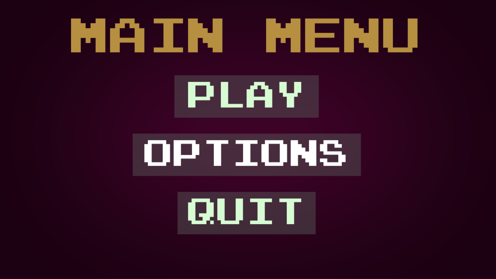
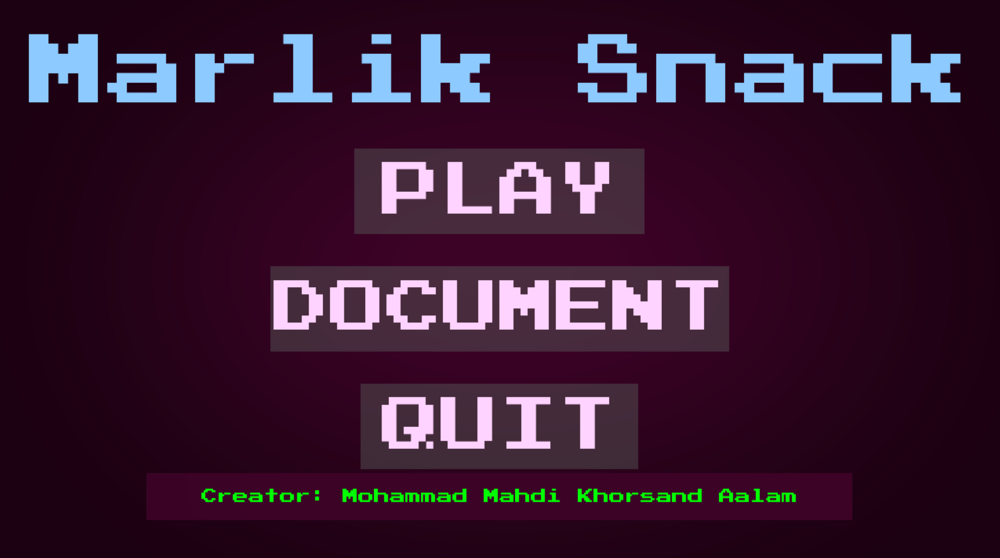

شخصی سازی منو
===============

برای شخصی سازی منو در ابتدا نیاز داریم کد های کامل شده بازی و را در قسمت باتن گیم کامل کنیم
کله تغییرات به شرح زیر است

کد تغییر داده شده در قسمت باتن :
::
    if event.type == pygame.MOUSEBUTTONDOWN:
                if PLAY_BUTTON.checkForInput(MENU_MOUSE_POS):
                    global s, snack
                    win = pygame.display.set_mode((width, width))
                    pygame.display.set_caption('Marlik Snake')
                    flag = True
                    clock= pygame.time.Clock()
                    
                    while flag:
                        pygame.time.delay(50)
                        clock.tick(10)        
                        s.move()
                        redrawWindow(win)
                        if s.body[0].pos == snack.pos:
                            s.addCube()
                            snack = cube(randomSnack(rows, s), color=(0,255,0))
                        for x in range(len(s.body)):
                            if s.body[x].pos in list(map(lambda z:z.pos,s.body[x+1:])):
                                print('Score: ', len(s.body))
                                message_box('! باختی که ', '... یه بار دیگه تلاش کن ')
                                s.reset((10,10))
                                break
                            

همان طور که میبینید ساختار باختن بازی نیست به قسمت گیم اضافه شده همچنین با صدا زدن تابع 
message_box
این امکان فراهم میشود که پس از باخت پیامی مبنی بر باخت در پنجره ایی جدید به نمایش در بیاید

ساختار کد به شکل زیر است :
::
    for x in range(len(s.body)):
                            if s.body[x].pos in list(map(lambda z:z.pos,s.body[x+1:])):
                                print('Score: ', len(s.body))
                                message_box('! باختی که ', '... یه بار دیگه تلاش کن ')
                                s.reset((10,10))
                                break

همان گونه که مشخص است لوپ بالا همیشه در حال چک کردن طول بدن مار است که و در زمان پوزشین سر مار با مربعی از بدنه برخورد کند پیامی مبنی بر باخت چاپ میشود
و بازی از حلقه خارج میشود و بریک میشود

* در ادامه ما نیاز به شخصی سازی باتن اپشن و تغییر آن به داکیومنت برای فرستاده شدن به همین داک داریم
-----------------------------------------------------------------------------------------------------------

در ابتدا کد اورجینال را در قسمت آپشن میبینید :
::
    MENU_TEXT = get_font(100).render("MAIN MENU", True, "#b68f40")
        MENU_RECT = MENU_TEXT.get_rect(center=(640, 100))

        PLAY_BUTTON = Button(image=pygame.image.load("assets/Play Rect.png"), pos=(640, 250), 
                            text_input="PLAY", font=get_font(75), base_color="#d7fcd4", hovering_color="White")
        OPTIONS_BUTTON = Button(image=pygame.image.load("assets/Options Rect.png"), pos=(640, 400), 
                            text_input="OPTIONS", font=get_font(75), base_color="#d7fcd4", hovering_color="White")
        QUIT_BUTTON = Button(image=pygame.image.load("assets/Quit Rect.png"), pos=(640, 550), 
                            text_input="QUIT", font=get_font(75), base_color="#d7fcd4", hovering_color="White")

در بالا در قسمت زیر :
::
    OPTIONS_BUTTON = Button(image=pygame.image.load("assets/Options Rect.png"), pos=(640, 400), 
                            text_input="OPTIONS", font=get_font(75), base_color="#d7fcd4", hovering_color="White")

اسم باتن آپشن همراه با ویژگی های به خصوصش از جمله رنگ فونت جداگانه ایی که به عنوان یک اسٍت معرفی شده و همچنین رنگ مورد نظر اعمال شده
که ما در قسمت زیر:
::
     text_input="OPTIONS"

را به شکل زیر تغییر میدهیم:
::
    text_input="DOCUMENT"

سپس نوبت به تغییر عنوان بالای منو به اسم بازی میرسد 
در تکه کد زیر به صورت پیش فرض عنوان به این شکل با خصوصیات مشخص تعریف شده :
::
    MENU_TEXT = get_font(100).render("MAIN MENU", True, "#b68f40")
        MENU_RECT = MENU_TEXT.get_rect(center=(640, 100))

دقت داشته باشین که قسمت زیر:
::
    center=(640, 100)

در تمامی تعریف باتن ها نقش جایگاه باتن یا نوشته عنوان ما را داراست

پس از اعمال تغییرات کد ما به شکل زیر در میاید:
::
    MENU_TEXT = get_font(100).render("Marlik Snack", True, "#8dcaff")
        MENU_RECT = MENU_TEXT.get_rect(center=(640, 100))

در ادامه به دنبال اضافه کردن اسم خود برای نشان دادن خالص این اثر نیاز به تعریف یک شبه باتن جدید داشتم
اما به دلیل نبود است مورد نیاز که به عنوان بک گراند هر باتن تعریف شده با استفاده از فوتوشاپ است جدید را ساخته و اضافه میکنم

کد های اضافه شده برای نمایش اسم خالق اثر :
::
    Creator_BUTTON = Button(image=pygame.image.load("assets/Untitled-1.png"), pos=(640, 640), 
                            text_input="Creator: Mohammad Mahdi Khorsand Aalam", font=get_font(20), base_color="#00ff00", hovering_color="White")

همچنین برای معرفی به تابع اسکرین جهت نمایش باتن جدید تغییرات زیر اعمال شده:
::
    for button in [PLAY_BUTTON, OPTIONS_BUTTON, QUIT_BUTTON, Creator_BUTTON]:
            button.changeColor(MENU_MOUSE_POS)
            button.update(SCREEN)

همانطور که میبینید متغییر جدید تعریف شده به تابع اسکرین فرستاده میشود تا در نهایت رندر و در صفحه نمایش داده شود

* کل تغییرات اعمال شده به شکل زیر است 
########################################

شکل منو عقب از انجام تمام تغییرات :

منو پس از انجام تمام تغییرات :

در مرحله بعد حال به نحوه ایجاد این داکیومنت میپردازیم
